# GUÍA COMPLETA DE ASTRO LEAP

Todo lo que hay en el juego: pilotos, fórmulas de combate, bestiario, estrategia contra cada jefe y el mapa completo de los 12 niveles con sus secretos. Los mapas se generan con el motor real del juego (`npm run generate-level-maps`), así que son exactamente lo que te vas a encontrar.

**Cómo leer los mapas:**

- **INICIO** — donde apareces (y reapareces al perder una vida).
- **BASE** 🟡 — la meta. En niveles de jefe, no puedes cruzarla mientras el jefe viva.
- **LvN** sobre cada enemigo — su nivel. **JEFE** marca a los guardianes.
- **♥** — cápsula de vida (+1 vida) · **⚡** — célula de energía (+1 Energía máxima, permanente) · **◆ dorado** — Cristal de Señal (objetivo secundario, ver §4c).
- **Franjas ámbar** en una plataforma — refuerzo que solo Scrap rompe al caminar encima.
- **Plataforma agrietada** — frágil: se desmorona al pisarla (ver Peligros).
- **Raíl punteado vertical** — plataforma móvil que sube y baja por ese recorrido.
- **Columna cian vertical entre dos emisores ámbar** — puerta de energía (dibujada activa en el mapa).
- **Chevrones animados** en una plataforma — cinta que te arrastra en esa dirección.
- Color de plataforma según el mundo: violeta (Luna Cenizal), hielo (Grietas — y ahí **resbala de verdad**, ver Peligros), gris metal (resto).

---

## 1. El jugador

Empiezas cada partida con: **HP 22 · Energía 10 · Ataque 5 · Defensa 2 · 3 vidas**.

Cada subida de nivel **cura del todo, rellena la Energía** y da **+5 HP máx, +2 EN máx, +2 ATQ, +1 DEF** — y además **+1 punto de mejora** para el árbol (ver 1b).

| Subir a Lv | 2 | 3 | 4 | 5 | 6 | 7 | 8 | 9 |
|---|---|---|---|---|---|---|---|---|
| XP necesaria | 10 | 15 | 22 | 33 | 50 | 75 | 112 | 168 |

La **Energía** es un recurso único: paga tu habilidad aérea en plataformas Y la Habilidad en combate. Solo se recupera derrotando enemigos (**+2 por derrota**, pisotón o duelo), al subir de nivel (rellena todo) o al empezar/reiniciar un nivel. Nunca con el tiempo.

## 1b. El árbol de mejoras

Cada subida de nivel da **1 punto de mejora**. Se gastan en el **árbol de mejoras**: en el mapa estelar, toca la chapa **MEJORAS** (bajo la del piloto — brilla cuando tienes puntos) o pulsa **T**. Tres ramas de 3 nodos; cada nodo cuesta 1 punto y **exige el anterior de su rama**. Una partida completa da ~8-9 puntos: no puedes tenerlo todo — elegir es el juego.

| Rama | Nodo 1 | Nodo 2 | Nodo 3 |
|---|---|---|---|
| 🩷 **COMBATE** | **Punto débil** — Atacar tiene un 25% de crítico (daño ×1.5) | **Guardia férrea** — Defender reduce al 35% (en vez de al 50%) | **Ejecutor** — la Habilidad hace ×2 (en vez de ×1.5) |
| 🩵 **ENERGÍA** | **Reciclador** — +3 EN por derrota (en vez de +2) | **Habilidad eficiente** — la Habilidad cuesta 2 EN (en vez de 3) | **Núcleo amplio** — +4 EN máx, al instante |
| 💚 **SUPERVIVENCIA** | **Blindaje** — +6 HP máx, al instante | **Aislante** — puertas, tormenta y muro hacen la mitad de daño | **Sistema de emergencia** — 1 vez por nivel, un golpe letal te deja a 1 HP |

Detalles finos:

- Las mejoras son **de la partida**, como el resto de la progresión: se guardan al continuar, y se pierden todas con un Game Over o al terminar el juego.
- Ninguna mejora toca el salto ni la velocidad — el traversal es sagrado (los secretos y las rutas seguirían midiendo lo mismo).
- El crítico de Punto débil usa el azar sembrado: en el **Reto Diario** los críticos caen igual para todo el mundo. Eso sí, en el reto los puntos que ganes no se pueden gastar (no hay mapa) — el reto se juega con el piloto pelado.
- El Sistema de emergencia se rearma al reaparecer o recargar el nivel, y no salva de las caídas al vacío (no son un «golpe»).

## 2. Los 4 pilotos

Los 4 comparten HP/ATQ/DEF/Energía y progresión (es un único cadete con el cuerpo intercambiado). Se cambia de piloto en el mapa estelar (chapa o tecla `C`).

### Kes 🩵 — Doble salto *(desde el inicio)*
Segunda pulsación de salto en el aire = impulso vertical extra (1 EN). **El truco**: pulsar cerca del ápice del primer salto da bastante más altura que pulsar nada más despegar — dos células de energía (⚡ de Chatarral y del Reactor) exigen dominarlo. En combate su Habilidad se llama *Sobrecarga*.

### Bolt 💛 — Vuelo breve *(vence a la Reina Larva)*
Mantén pulsado el salto en el aire para ascender despacio (1 EN cada ~0,37s; un tanque de 10 da ~3,7s de vuelo). El único que alcanza la plataforma altísima de Grietas de Hielo con su ⚡. Habilidad: *Pulso EMP*.

### Shade 🩷 — Impulso lateral *(vence al Centinela)*
Una pulsación en el aire = dash horizontal de 12 frames (1 EN). No gana altura, pero cruza los huecos más anchos del juego — como el del Nido de la Reina Larva, con su ♥ (hay red de seguridad debajo: si fallas, no pierdes nada). Habilidad: *Zarpazo*.

### Scrap 🧡 — Rompe refuerzos *(vence al Overlord)*
Sin habilidad aérea — la ruta baja de piedras de paso existe para él. A cambio, al **caminar sobre una plataforma de franjas ámbar la rompe** y cae a lo que esconde: tres bóvedas con premio (niveles 1, 10 y 11). Los refuerzos rotos quedan rotos toda la partida. Habilidad: *Puño Cibernético*. En la ficción, es quien abre el Mundo 4.

## 3. Combate: las fórmulas exactas

| Acción | Efecto |
|---|---|
| **1. Atacar** | `ATQ × (0.8–1.2) − DEF enemiga` (mínimo 1) |
| **2. Habilidad** | `ATQ × 1.5 − DEF enemiga`, **sin azar** — daño fiable. Cuesta 3 EN |
| **3. Defender** | El próximo golpe hace `bruto × 0.5` (ojo: sin restar tu DEF, pero suele compensar) |
| **4. Huir** | 50% de éxito. Si escapas: 3s de invulnerabilidad. Si no: el enemigo golpea |

El daño que recibes sin defender es `ATQ enemigo × (0.8–1.2) − tu DEF` (mínimo 1).

**Acelerar los turnos**: mantén pulsado **ESPACIO** (o el dedo en la pantalla, en táctil) y las pausas de mensaje corren a 4×. Mantener ya no dispara acciones en cadena — pulsar decide, mantener acelera.

**El pisotón**: si caes sobre la mitad superior de un enemigo (`vy > 0`) **y tu nivel supera al suyo**, muere al instante — XP completa, +2 EN, sin duelo, y rebotas hacia arriba. Es la forma rápida de limpiar niveles. Si no te da el nivel (o el contacto es lateral), transición de encuentro y duelo.

## 4. Bestiario

| Enemigo | Nv | HP | ATQ | DEF | XP | Comportamiento | Pisoteable desde |
|---|---|---|---|---|---|---|---|
| Dron | 1 | 7 | 3 | 1 | 5 | Patrulla lenta | Lv2 |
| Reptante | 2 | 11 | 4 | 2 | 8 | Patrulla rápida | Lv3 |
| Erizo de Púas | 3 | 15 | 6 | 2 | 12 | **Salta** cada ~2s — cuidado al pisotearlo | Lv4 |
| Hoverbot | 4 | 16 | 6 | 3 | 14 | **Vuela** en onda senoidal | Lv5 |
| Magnetita | 5 | 22 | 8 | 5 | 18 | Lenta pero con mucha DEF — usa la Habilidad | Lv6 |
| Espectro Iónico | 6 | 20 | 9 | 3 | 22 | **Vuela** rápido y con recorrido amplio | Lv7 |

Los voladores son los más traicioneros de pisotear: su vaivén vertical hace fácil comerse el contacto lateral.

## 4b. Peligros del terreno

El Mundo 1 estrena el terreno con un solo giro (el hielo del nivel 2 — que además es herramienta, no solo peligro); a partir del Mundo 2 el propio suelo empieza a conspirar, y en el 4 está todo junto:

| Peligro | Debut | Cómo funciona | Cómo se supera |
|---|---|---|---|
| **Hielo resbaladizo** (suelo azul hielo) | Mundo 1 (nivel 2) | Todo el suelo del nivel tiene inercia: acelera con carrerilla hasta **superar tu velocidad normal** (1.55 → 2.6), frenas y giras despacio, y al soltar la dirección sigues deslizándote (~25u hasta pararte). **El impulso se conserva al saltar**: un salto con carrerilla llega a ~68u en llano frente a los ~42 del salto normal | Es el único "peligro" que también es un regalo: usa la carrerilla para los dos saltos largos del tramo final (el del islote de la ♥ y el salto final a la BASE). El peligro real es frenar tarde junto a un borde o un enemigo — suelta la dirección con antelación o pulsa la contraria |
| **Plataforma frágil** (agrietada) | Mundo 2 (nivel 4) | Al pisarla tiembla y se desmorona a los ~0,8s. **Reaparece a los 3s** — nunca te deja encerrado | No te pares encima: cruza de una pasada. Si cae, espera a que reaparezca |
| **Plataforma móvil** (raíl punteado) | Mundo 2 (nivel 4) | Sube y baja en ciclo constante. Te lleva encima sin resbalar | Son atajos de ruta alta — el camino obligatorio nunca depende de ellas en los 12 niveles del mapa. **Excepción**: en los niveles Extra pueden ser **ascensores obligatorios** (Aguja Glacial) — espera a que baje, súbete y viaja |
| **Tormenta iónica** (ciclo de cielo) | Mundo 2 (nivel 5) | Ciclo global de 8,5s: **5s de calma** → **1,5s de aviso** (tinte ámbar, «⚠ TORMENTA INMINENTE») → **2s de descarga** (tinte violeta y rayos). Durante la descarga, estar **al raso** hace 5 de daño con tregua de invulnerabilidad (~hasta 3 golpes si aguantas fuera la descarga entera) | La regla del techo: estás a salvo con **cualquier plataforma sólida encima de la cabeza** — el resplandor cian bajo las plataformas te marca dónde. Corre de refugio en refugio durante la calma; si el aviso te pilla a medias, métete bajo la flotante más cercana o paga el peaje en HP |
| **Barrido del Centinela** (franja roja en el suelo) | Mundo 2 (nivel 6) | Solo mientras el jefe viva: ciclo de 5s — **3s de calma** → **1s apuntando** (la franja del suelo se enciende en rojo) → **1s de onda** a ras de suelo por TODA su zona. Pisar el suelo durante la onda hace **6 de daño**, con tregua corta (quedarte el barrido entero cuesta dos golpes) | Súbete a una **cobertura elevada** (brillan en cian al apuntar; dos son frágiles...) o gasta habilidad aérea para aguantar en el aire — un salto simple (27f) NO dura lo que la onda (60f). Al ganar el duelo, la zona se apaga |
| **Puerta de energía** (columna vertical entre emisores) | Mundo 3 (nivel 7) | Bloquea el paso a ras de suelo con ciclo fijo de 2,5s: 1,5s apagada → 0,25s de aviso (chisporroteo) → 0,75s activa. Activa hace **4 de daño** y te empuja hacia atrás, con tregua de invulnerabilidad | Tres opciones: **esperar** el ciclo (el chisporroteo es tu semáforo), **saltarla por arriba** con habilidad aérea (40 de alto: el salto simple no llega, el doble salto/vuelo/dash sí — la Energía compra tiempo), o **atravesarla pagando** los 4 de daño y aprovechando la tregua. Las puertas de un mismo nivel van desfasadas |
| **Cinta magnética** (chevrones) | Mundo 3 (nivel 9) | Te arrastra ~30% de tu velocidad en la dirección de los chevrones — siempre en contra | Camina sin pararte (avanzas igual, más despacio) y no te detengas cerca de un borde |

Todos los peligros con ciclo van con reloj **de frames, no de tiempo real**: el patrón es idéntico en cualquier máquina, y en el Reto Diario es el mismo para todo el mundo (de los niveles del reto, 1–2, solo el 2 tiene peligro — el hielo, que no depende de ningún reloj).

## 4c. Objetivo secundario: Cristales de Señal ◆

Restos de la red de vigilancia de quienes construyeron al Centinela «hace mucho, para detener esto». Hay **tres cristales por nivel del mapa (36 en total)** — uno fácil, uno intermedio y uno «de firma» del nivel — siempre fuera del camino directo. Reunirlos **triangula los emisores supervivientes** de esa red: las torres.

- Con **8 cristales** aparece en el mapa estelar la puerta de la **[Torre de Vigía](#nivel-extra--torre-de-vigía--vertical)** — al alcance de quien explora el Mundo 1 a fondo.
- Con **20** aparece la de la **[Aguja Glacial](#nivel-extra-2--aguja-glacial--vertical--hielo--ascensores)** — hacia la mitad del juego.
- Sobran 16 de margen: ni de lejos hace falta el pleno para abrirlo todo.

Las puertas son nodos dorados con anillo, abajo del mapa, fuera de la constelación — no se dibujan bloqueadas: **aparecen** («¡SEÑAL TRIANGULADA!») al cruzar cada umbral. El contador ◆ va en el HUD (bajo el cronómetro) y en el mapa. Los cristales **se guardan con la partida** y, como toda la progresión, **se pierden con el Game Over** (las torres vuelven a ocultarse). En el Reto Diario no cuentan.

Dónde están (los tres de cada nivel, de fácil a difícil):

| Nivel | Los 3 cristales |
|---|---|
| 1 · Cráter | Flotante del arranque · flotante del medio · plataforma alta del final (con reptante al lado) |
| 2 · Grietas | Flotante del tramo medio · **dentro de la grieta del set piece** (bucea a por él) · meseta del salto final |
| 3 · Nido | Flotante [220,140] · flotante [400,135] · antesala de la arena de la Reina |
| 4 · Chatarral | Sobre el suelo de salida · **punto alto de la móvil** · flotante del tramo final |
| 5 · Tormenta | Flotante de la 1ª carrera · flotante de la 2ª · **techo del refugio D** (habilidad aérea + expuesto a la tormenta) |
| 6 · Centinela | Flotante [260,130] · **punto alto de la móvil** · antesala del jefe |
| 7 · Muelle | Flotante del arranque · en el ápice del salto sobre [590,130] · suelo largo del final |
| 8 · Túnel | Flotante [170,140] · **sobre la frágil [650,140]**, con el muro pisándote los talones · flotante del final |
| 9 · Reactor | Flotante [235,130] · flotante [600,125] · **sobre la cinta magnética** (salta mientras te arrastra) |
| 10 · Bóveda | Flotante [230,130] · flotante [590,130] · plataforma alta del final |
| 11 · Galería | Flotante [190,145] · flotante [450,105] · **punto alto de la 2ª móvil** |
| 12 · Nodo Cero | Sobre la frágil del arranque (con espectro) · frágil del medio · **punto alto de la móvil de la arena** |

Con salto simple sobran para ambas puertas: **Scrap puede abrir las dos torres él solo** — los de las móviles y el techo del refugio piden montarse o habilidad aérea, pero nunca son imprescindibles.

## 5. Los 4 jefes

Los jefes no patrullan: te esperan ante la meta. No puedes cruzar la BASE mientras vivan.

### 🌸 Reina Larva — Nido de la Reina Larva (nivel 3)
**Lv8 · 55 HP · ATQ 12 · DEF 6 · 60 XP** → desbloquea a **Bolt**

Cada 3er turno suyo **se regenera +6 HP** en vez de atacar. Es una carrera de daño: si tu daño por ronda no supera con margen su curación, la pelea se eterniza. Llega al menos a **Lv4** (ATQ 11): la Habilidad hace 10 fijo por 3 EN. Aprovecha sus turnos de curación (no te daña) para atacar sin miedo en vez de defender.

### 🛡️ Centinela — Núcleo del Centinela (nivel 6)
**Lv12 · 90 HP · ATQ 17 · DEF 9 · 120 XP** → desbloquea a **Shade**

Cada 3er turno **carga** ("carga una descarga...", sin daño) y al siguiente **golpea el doble** (27–40 de daño bruto). El aviso es tu ventana: **Defiende justo después de la carga** y el golpe reforzado se queda a la mitad. El resto de turnos, ataca. Recomendado **Lv7–8**.

### 👁️ Overlord — Núcleo del Reactor (nivel 9)
**Lv16 · 140 HP · ATQ 23 · DEF 12 · 220 XP** → desbloquea a **Scrap**

Cada 3er turno **ignora Defender** — defenderse en ese turno es desperdiciarlo. Cuenta sus turnos (1, 2, ⚠️3, 4, 5, ⚠️6…) y reserva Defender para los turnos normales cuando estés bajo de HP. Con su DEF 12, el ataque básico raspa: la Habilidad (fija, sin azar) es tu fuente de daño fiable. Recomendado **Lv10–12**.

### 🔴 Nodo Cero — Nodo Cero (nivel 12, jefe final)
**Lv20 · 190 HP · ATQ 27 · DEF 14 · 380 XP**

Combina los tres patrones en un **ciclo de 6 turnos**:

| Su turno | 1 | 2 | 3 | 4 | 5 | 6 |
|---|---|---|---|---|---|---|
| Hace | ataca | ataca | **cura +22** | **carga** | **golpe ×2** | **ignora Defender** |

La partitura: ataca con todo en 1–3 (la cura no te daña — turno gratis para ti), **Defiende en tu turno entre la carga y el golpe ×2**, y en el 6 no defiendas (no sirve) — pega o cúrate de camino con una subida de nivel si la tienes cerca. Recomendado **Lv13+** y llegar con las 3 células ⚡ recogidas para encadenar Habilidades.

> 💡 Dato curioso: el pisotón también funciona sobre jefes si tu nivel supera al suyo — imposible la primera vez que los enfrentas, pero al rejugar niveles con nivel alto puedes literalmente aplastar a la Reina Larva.

---

## 6. Los 12 niveles, mapa a mapa

### Nivel 1 · Cráter de Amerizaje (Luna Cenizal)

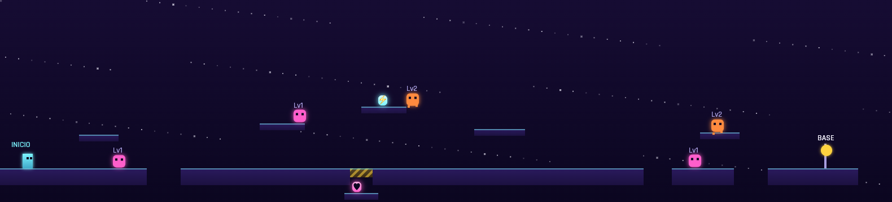

Tutorial de salto y energía. Enemigos: 3 drones Lv1, 2 reptantes Lv2.
- **⚡ Célula**: sobre la plataforma flotante más alta del primer tramo — escalera de saltos simples.
- **♥ Cápsula**: en una bóveda bajo el suelo, tapada por un **refuerzo ámbar** a mitad de nivel — solo Scrap (vuelve cuando lo tengas).

### Nivel 2 · Grietas de Hielo (Luna Cenizal)

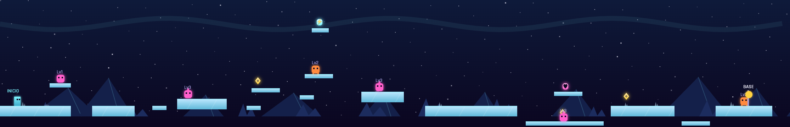

El nivel del **hielo resbaladizo** (ver Peligros): todo el suelo tiene inercia — carrerilla que supera tu velocidad normal y se conserva al saltar. Primeros huecos que premian el doble salto; erizos que saltan: pisotéalos cuando estén en el suelo.
- **El set piece**: el tramo final es una pista de despegue de hielo que desemboca en un hueco de 52 en llano — imposible para el salto normal (~42), cómodo con carrerilla a tope. Si te quedas corto, la red de seguridad del fondo de la grieta te recoge (no pierdes nada) y de ahí se sube a la meseta con un salto simple: la ruta de Scrap y de quien falle el salto. Ojo: un erizo patrulla la red bajo el islote — la ruta lenta tiene peaje.
- **El salto final**: la meseta es la segunda pista de despegue — un hueco de **58** (aún más ancho) hasta la plataforma de la BASE, para saborear el salto largo ya sin premio en juego. Misma regla: red de seguridad debajo y salida con salto simple.
- **♥ Cápsula**: en el islote elevado al otro lado del hueco del set piece — se aterriza en él **solo con el salto con carrerilla** desde la pista (o gastando Energía en habilidad aérea; desde la grieta de abajo queda fuera de alcance). Si lo pasaste de largo, también sale con carrerilla hacia atrás desde la meseta final.
- **⚡ Célula**: en la plataforma altísima del tramo central — **solo el vuelo de Bolt** llega.

### Nivel 3 · Nido de la Reina Larva (Luna Cenizal) — JEFE

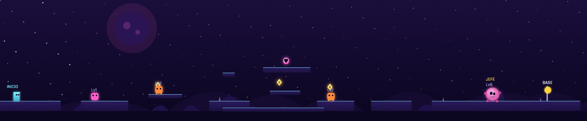

- **♥ Cápsula**: tras un hueco horizontal imposible de saltar (con red de seguridad debajo) — **solo el dash de Shade** lo cruza.
- **Jefe**: [Reina Larva](#-reina-larva--nido-de-la-reina-larva-nivel-3). Limpia los enemigos del camino para llegar con nivel y Energía.

### Nivel 4 · Chatarral Magnético (Luna Ferrosa)

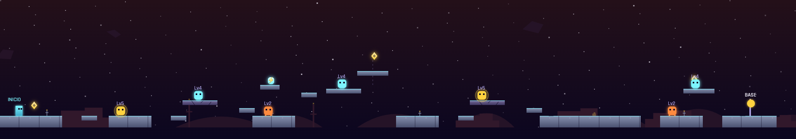

Debut de hoverbots (voladores) y magnetitas (DEF alta) — y de dos peligros nuevos: los dos islotes agrietados son **frágiles** (cruza sin pararte) y hay una **plataforma móvil** como atajo de ruta alta.
- **⚡ Célula**: plataforma secreta sobre el tercer islote — **doble salto cronometrado** (púlsalo en el ápice).

### Nivel 5 · Tormenta de Iones (Luna Ferrosa)

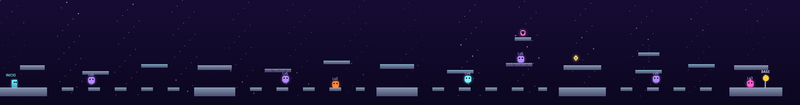

El primer nivel con **presión temporal**: la tormenta iónica descarga en ciclo (ver Peligros) y el nivel es una cadena de **5 refugios** (isla + techo) separados por carreras abiertas — corre durante la calma, cobíjate en la descarga. La ruta alta de flotantes sigue pidiendo habilidad aérea (y las propias flotantes dan techo de emergencia a quien va por abajo); el camino bajo son piedras de paso llanas. Espectros iónicos patrullan las carreras, un reptante vigila las piedras y un erizo guarda la isla de la meta.
- **♥ Cápsula**: plataforma altísima sobre la flotante frágil de la 3ª carrera — **doble salto cronometrado dos veces** (flotante → frágil → secreta), con un espectro rondando, la frágil desmoronándose y la tormenta metiendo prisa. La móvil de la 4ª carrera es un atajo de ruta alta normal, no lleva al secreto.

### Nivel 6 · Núcleo del Centinela (Luna Ferrosa) — JEFE

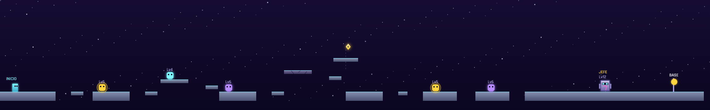

El dominio del Centinela: desde x≈140 hasta su arena, **barre el suelo con ondas de energía** en ciclo (ver Peligros) mientras siga vivo — el nivel es un mini-jefe de plataformas ANTES del duelo. Corre durante la calma y, cuando la franja del suelo se encienda en rojo, súbete a una de las **coberturas elevadas** (brillan en cian; dos son **frágiles** y pueden desmoronarse contigo encima en plena onda). Magnetitas, espectros y un hoverbot patrullan entre ondas, y la **móvil** sigue siendo la ruta alta.
- **Jefe**: [Centinela](#%EF%B8%8F-centinela--núcleo-del-centinela-nivel-6). Tras ganar el duelo, la zona se apaga — rejugar el nivel limpio es un paseo.

### Nivel 7 · Muelle de Carga (Estación Colapsada)

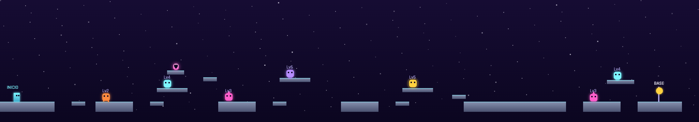

Mezcla de todo el bestiario y **debut de las puertas de energía**: dos, desfasadas entre sí, plantadas en el suelo a mitad y al final del nivel — espera el hueco del ciclo o salta por encima con tu habilidad aérea. Aquí recoges la pieza de la nave — y despiertas el núcleo (narrativamente: por esto el nivel 8 es lo que es).
- **♥ Cápsula**: plataforma secreta sobre el segundo islote — **salto simple** bien colocado.

### Nivel 8 · Túnel de Escape (Estación Colapsada) — SCROLL FORZADO

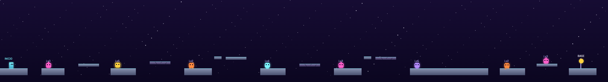

5 segundos de cuenta atrás — que **no te retienen: sal corriendo desde el primer segundo** (la cámara te sigue, y el muro arrancará desde donde estés cuando acabe la cuenta, así que cada metro ganado es ventaja real) — y un **muro de energía** avanza desde la izquierda, empujando y dañando (3 de daño por toque, con tregua entre golpes). El muro (0.55) es más lento que tú corriendo (1.55): **no pares** y le sacarás pantalla y media de ventaja — puedes permitirte fallar un salto. Todos los huecos se cruzan con salto simple, pero ahora tres islotes elevados son **frágiles**: con el muro detrás, pararse encima a pensar es mala idea por partida doble. Consejo: ignora a los enemigos (pisotón al vuelo como mucho) — el muro se congela durante los duelos, así que no te matan, pero queman cronómetro si vas a por marca.

### Nivel 9 · Núcleo del Reactor (Estación Colapsada) — JEFE

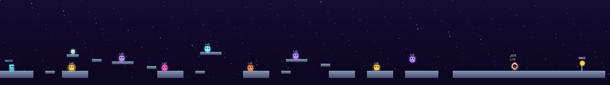

El nivel más largo de enemigos antes del [Overlord](#️-overlord--núcleo-del-reactor-nivel-9): 8 enemigos Lv2-6 — una mina de XP y Energía. Dos puertas de energía desfasadas (una en plena arena del jefe), un islote **frágil**, y **debut de la cinta magnética**: la antesala del jefe te arrastra hacia atrás (camina sin pararte).
- **⚡ Célula**: plataforma secreta nada más empezar, sobre el segundo islote — **doble salto cronometrado**. Cógela ANTES del jefe.

### Nivel 10 · Bóveda Sellada (Núcleo Expuesto)

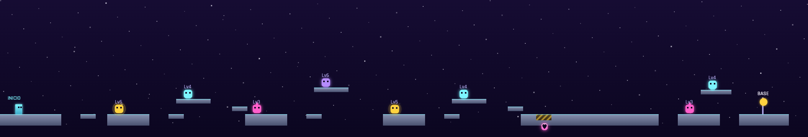

El mundo que solo se entiende con Scrap desbloqueado. Mundo 4 = todo junto: un **pasillo de doble puerta desfasada** justo después de la bóveda del refuerzo, un islote **frágil** y una **cinta** en contra en el tramo final.
- **♥ Cápsula**: bóveda bajo el **refuerzo ámbar** del último tramo — solo Scrap.

### Nivel 11 · Galería de Ecos (Núcleo Expuesto)

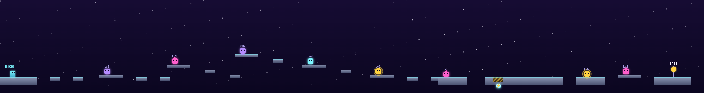

Huecos largos estilo Tormenta de Iones, con piedras de paso para la ruta baja — pero una de las piedras es **frágil**, hay **dos móviles** de atajo en la ruta alta, otro islote frágil y una puerta de energía custodiando el tramo tras la bóveda.
- **⚡ Célula**: bóveda bajo el **refuerzo ámbar** cerca del final — solo Scrap. La última mejora permanente del juego.

### Nivel 12 · Nodo Cero (Núcleo Expuesto) — JEFE FINAL

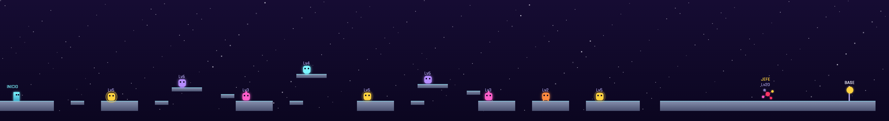

9 enemigos de todo el bestiario en escalada hasta [Nodo Cero](#-nodo-cero--nodo-cero-nivel-12-jefe-final), con el examen final del terreno: dos islotes **frágiles**, una **móvil**, una **cinta** en contra y una **doble puerta desfasada en la propia arena**, el último control antes del jefe. Pisotea todo lo que puedas para llegar con la Energía llena: el duelo final premia poder encadenar Habilidades.

### Nivel Extra · Torre de Vigía — VERTICAL

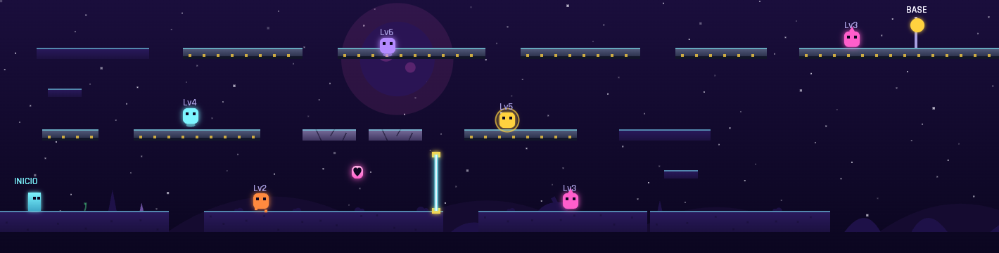

El primer nivel **vertical** del juego: tres pisos (suelo, y=92 y y=34) recorridos en **serpentín** — derecha por el suelo, escalera al fondo derecho, izquierda por el piso 2, escalera en zigzag al fondo izquierdo, y derecha por el piso 3 hasta la BASE, que espera arriba del todo. La separación entre pisos (**58**) no la sube **ni el doble salto** (su ápice + ventana de aterrizaje llega a ~56): de piso a piso solo se sube por los peldaños de las escaleras (subidas de 29, salto simple) — únicamente el vuelo sostenido de Bolt puede saltárselas.

- **Caerse de un piso cuesta tiempo, no vidas**: cada hueco de los pisos 2-3 tiene suelo debajo (incluido un suelo de recogida bajo la escalera derecha). Los únicos huecos letales son los dos del suelo.
- El piso 2 se cruza de derecha a izquierda sobre **dos frágiles seguidas** — el peaje del serpentín: crúzalas de una pasada, cada una con su propia cuenta atrás. Si caen contigo, aterrizas en el suelo firme de abajo y a re-subir.
- Una **puerta de energía** corta el corredor del suelo, y en cada piso patrulla su fauna (reptante y erizo abajo, magnetita y hoverbot en el 2, espectro y erizo guardián arriba).
- **♥ Cápsula**: flotando entre pisos bajo las frágiles — un salto deliberado desde el corredor del suelo la roza en el ápice.
- **Cómo se entra**: reúne **8 Cristales de Señal ◆** (ver §4c) y su puerta aparece en el mapa estelar (nodo dorado con anillo). Completarla marca su ✓ pero no desbloquea nada más — es un desafío aparte, rejugable. (`?level=13` sigue funcionando como acceso de depuración.)

### Nivel Extra 2 · Aguja Glacial — VERTICAL + HIELO + ASCENSORES

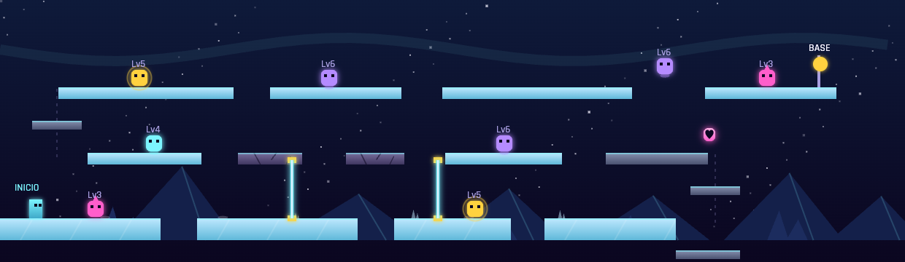

La torre difícil de verdad: el mismo serpentín de tres pisos que la Torre de Vigía, pero **el suelo resbala** y las escaleras son **ascensores** — dos plataformas móviles verticales que recorren un piso entero (viaje de ~4,4s) y hay que esperar a que bajen y abordarlas. Fallar el abordaje del 1º te deja en un bolsillo de recogida (reintenta desde ahí); fallar el 2º te devuelve al piso 1.

- **Piso 1**: todo hielo, con huecos letales y **dos puertas de energía desfasadas** — frenar sobre hielo ante una puerta es el examen del piso. Recuerda: suelta la dirección con ~40 de antelación o pulsa la contraria.
- **Piso 2** (derecha→izquierda): mixto — metal, hielo y **dos frágiles seguidas**. El borde izquierdo es hielo: llega frenado o te caerás al piso 1 esperando el ascensor.
- **Piso 3, la cumbre**: hielo de punta a punta y el final por todo lo alto: pista de 130 → **hueco de 50 que SOLO cruza el salto con carrerilla** (con un espectro patrullando el aire del hueco) → la BASE. Fallar el salto te deja en el piso 2: a re-subir.
- **♥ Cápsula**: flotando en el hueco del ascensor 1 — se recoge durante el viaje.
- 8 enemigos de fauna alta (Lv3-6). **Cómo se entra**: reúne **20 Cristales de Señal ◆** (ver §4c) y su puerta aparece en el mapa estelar. (`?level=14` sigue como acceso de depuración.)

---

## 7. Reto Diario

El mismo desafío para todo el mundo cada día: nivel (rota entre los sectores 1–2), piloto (entre los 4) y dificultad, deterministas según la fecha, con el azar del combate sembrado. Arrancas siempre con un piloto nuevo a Lv1 — tu progreso real no se toca.

| Dificultad | HP y ATQ de los enemigos |
|---|---|
| 🟢 Suave | ×0.85 |
| 🟡 Normal | ×1.0 |
| 🟠 Intensa | ×1.15 |
| 🔴 Brutal | ×1.3 |

Se puede reintentar sin límite; queda tu mejor tiempo del día, con botón de compartir.

### Duelos a distancia ⚔️

Al completar un reto, el botón **«Retar a un amigo con este tiempo»** comparte una URL con un token (`?duelo=...`) que codifica **la fecha del reto, tu tiempo y tu nombre** (se pide una vez, opcional). Quien la abra verá un botón de duelo en el menú y jugará **exactamente el mismo desafío** — el reto es determinista por fecha, así que el enlace reproduce ese nivel, piloto, dificultad y azar aunque se abra días después — contra tu **fantasma de ritmo**: una silueta translúcida de tu piloto que recorre el nivel al ritmo exacto para llegar a la meta en tu tiempo, con un delta en el HUD (`−1.2s` verde / `+2.3s` rojo) según vaya la carrera.

- Al terminar: veredicto (**¡DUELO GANADO!** / **DUELO PERDIDO** y por cuántos segundos) y botón de **revancha** con tu nuevo tiempo.
- Un duelo de otra fecha **no toca tu mejor tiempo de hoy**; si el duelo es del día de hoy, sí cuenta.
- El fantasma marca el ritmo, no la ruta (ignora el terreno) — y no consume el azar sembrado: la comparación es justa.
- El token lleva checksum: un enlace truncado o manipulado se ignora en silencio. Si pierdes, el duelo se puede reintentar desde el menú sin recargar.

## 8. Reglas de la sesión (vidas y farmeo)

- Morir (caída, duelo perdido, muro) = −1 vida y de vuelta al inicio del nivel con HP/EN llenos. Con 0 vidas, Game Over: todo el progreso se reinicia.
- Cápsulas ♥, células ⚡ y refuerzos rotos se recuerdan **toda la partida** — no se pueden refarmear saliendo y entrando.
- Rejugar un nivel completado, o re-matar un enemigo ya derrotado en la sesión, da **media XP**: farmear se puede, pero rinde la mitad.
