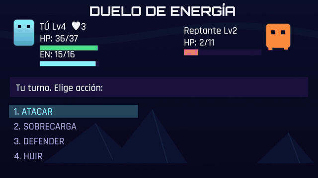
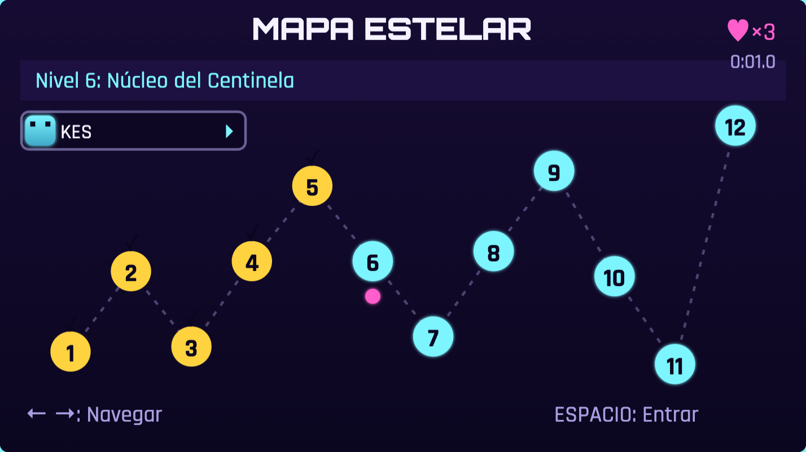
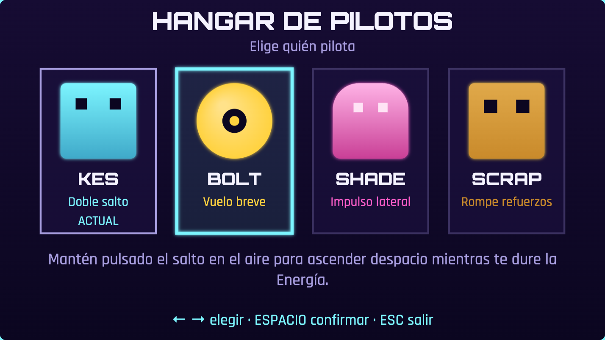
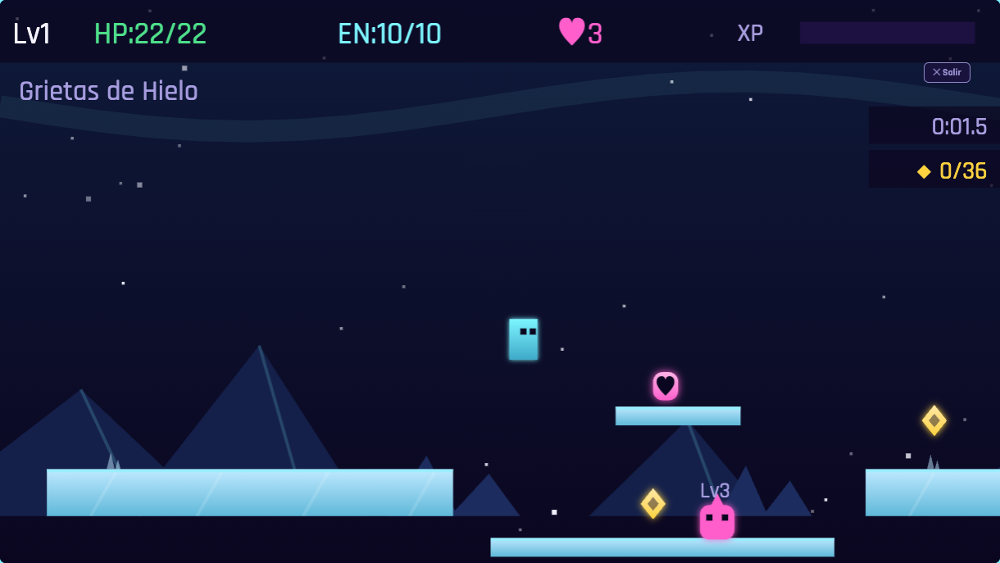
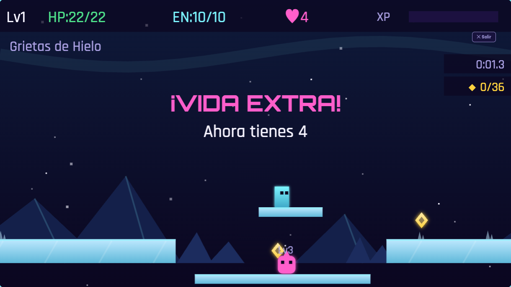
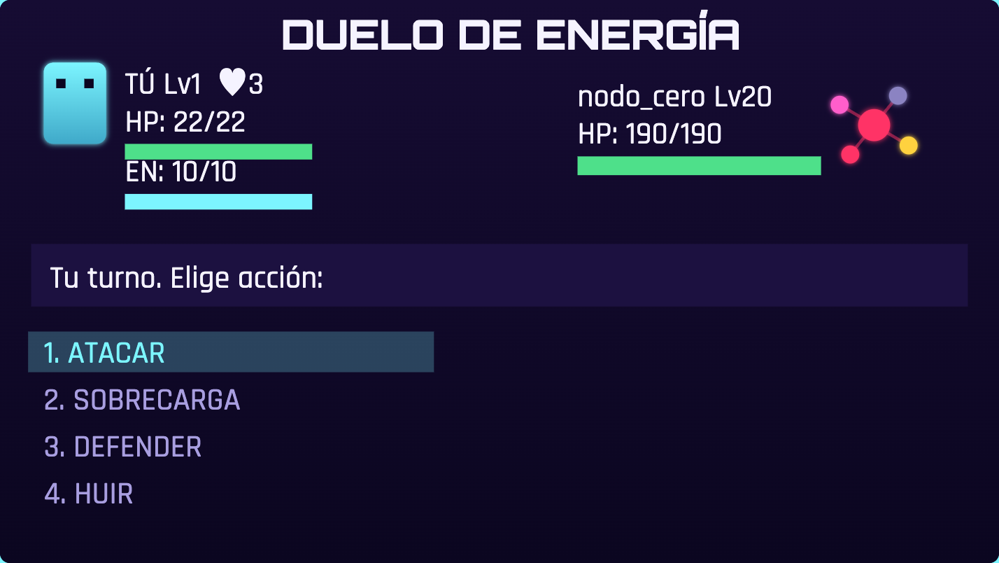
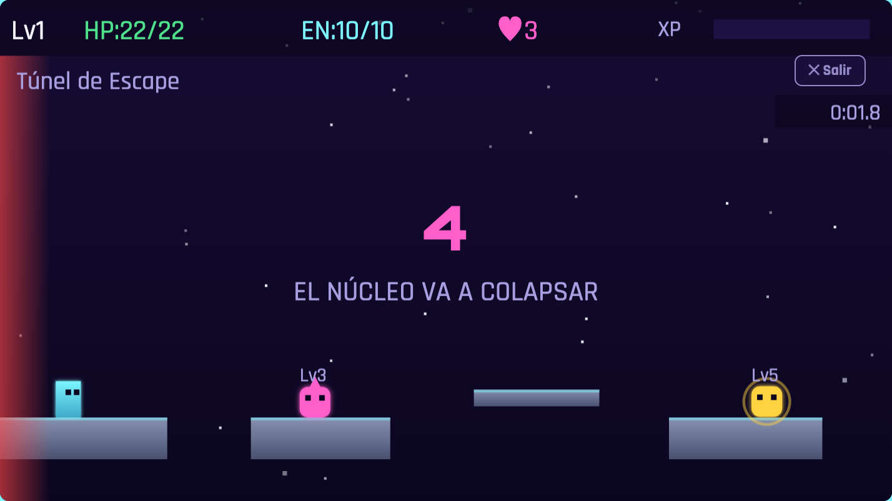

# ASTRO LEAP

Plataformas + duelos por turnos, ambientado en dos lunas alienígenas, una estación abandonada y el núcleo de una IA hostil. Como si **Super Mario Bros. y Pokémon compartieran motor**: exploras y saltas en tiempo real, pero cada enemigo es una decisión táctica. Construido sobre la misma mecánica que [Monster Jump](https://github.com/enrimr/juego-rol-plataformas) — ver [`DESIGN.md`](./DESIGN.md) para el diseño completo y [`LORE.md`](./LORE.md) para la historia.

**Juega ya: <https://astroleap.enri.me/>** — gratis, sin instalar nada, en móvil y escritorio.

📖 **[Guía completa](./GUIA.md)**: pilotos, fórmulas de combate, bestiario, estrategia contra cada jefe y el mapa completo de los 12 niveles con todos los secretos.



## Capturas

| El mapa estelar | El hangar de pilotos |
|---|---|
|  |  |

| Plataformas (Grietas de Hielo) | Un secreto encontrado |
|---|---|
|  |  |

| Duelo contra el jefe final | Scroll forzado (Túnel de Escape) |
|---|---|
|  |  |

Hay clips en vídeo de la habilidad de cada piloto, grabados por un bot que juega de verdad: [Kes](gameplay-kes.mp4) · [Bolt](gameplay-bolt.mp4) · [Shade](gameplay-shade.mp4) · [Scrap](gameplay-scrap.mp4) (ver `npm run record-gameplay` más abajo).

## La mecánica central: Energía compartida

La Energía es un recurso **único** que alimenta tanto la habilidad aérea en plataformas como la Habilidad en combate (daño ×1.5, cuesta 3). No se regenera con el tiempo — solo derrotando enemigos (+2 por derrota, sea pisotón o duelo) o al empezar un nivel. Cada salto extra que gastas es una carga menos para el próximo duelo.

Y cada enemigo es una elección de riesgo: **si le caes encima desde arriba y tu nivel supera al suyo, muere al instante** (pisotón, XP directa, sin menú). Cualquier otro contacto abre el duelo por turnos: Atacar, Habilidad, Defender (mitad de daño ese turno) o Huir (50%).

## Los 4 pilotos

Se elige piloto antes de entrar a un nivel (chapa del mapa o tecla `C` → hangar). Los 4 comparten stats de combate; lo que cambia es cómo se mueven — y con el mismo botón de salto:

| Piloto | Habilidad aérea | Coste | Habilidad en combate | Se desbloquea |
|---|---|---|---|---|
| **Kes** 🩵 | Doble salto (segunda pulsación en el aire) | 1 EN | Sobrecarga | Desde el inicio |
| **Bolt** 💛 | Vuelo breve (mantén pulsado el salto) | 1 EN / 22 frames | Pulso EMP | Vencer a la Reina Larva |
| **Shade** 🩷 | Impulso lateral (dash de 12 frames) | 1 EN | Zarpazo | Vencer al Centinela |
| **Scrap** 🧡 | Ninguna — pero **rompe las plataformas reforzadas** (franjas ámbar) al pisarlas | — | Puño Cibernético | Vencer al Overlord |

Todos los niveles se pueden completar con cualquier piloto (verificado por un test de alcanzabilidad BFS sobre la física real): los pilotos aéreos van por la **ruta alta**, más rápida; Scrap va escalón a escalón por el **camino bajo**, más lento pero seguro. Además hay un secreto dedicado por habilidad (una plataforma solo alcanzable en vuelo, un hueco solo cruzable con dash, y dos bóvedas selladas que solo Scrap abre).

## Los 4 mundos (12 sectores)

| Mundo | Sector | Nombre | Qué aporta |
|---|---|---|---|
| 1 · Luna Cenizal | 1 | Cráter de Amerizaje | Tutorial de salto/energía; bóveda reforzada de Scrap |
| | 2 | Grietas de Hielo | Primeros huecos que premian el doble salto; secreto de vuelo de Bolt |
| | 3 | Nido de la Reina Larva | **Jefe: Reina Larva** — se regenera cada 3 turnos; hueco de dash de Shade |
| 2 · Luna Ferrosa | 4 | Chatarral Magnético | Enemigos voladores; **debutan las plataformas frágiles y las móviles** |
| | 5 | Tormenta de Iones | Huecos largos, la ruta alta exige habilidad aérea |
| | 6 | Núcleo del Centinela | **Jefe: Centinela** — carga un turno y golpea el doble (ventana para Defender) |
| 3 · Estación Colapsada | 7 | Muelle de Carga | **Debutan los rayos eléctricos** (cíclicos, entre emisores); despierta el núcleo |
| | 8 | Túnel de Escape | **Scroll forzado**: tras 5s de cuenta atrás, un muro de energía avanza solo — con islotes frágiles bajo presión |
| | 9 | Núcleo del Reactor | **Jefe: Overlord** — ignora Defender cada 3 turnos; **debuta la cinta magnética** en contra |
| 4 · Núcleo Expuesto | 10 | Bóveda Sellada | El mundo que Scrap abre; todos los peligros combinados |
| | 11 | Galería de Ecos | Huecos largos + móviles, frágiles y rayos |
| | 12 | Nodo Cero | **Jefe final: Nodo Cero** — combina los 3 patrones anteriores; el terreno combina los 4 peligros |

## Bestiario

| Enemigo | Nv | HP | ATQ | XP | Rasgo |
|---|---|---|---|---|---|
| Dron | 1 | 7 | 3 | 5 | Patrulla |
| Reptante | 2 | 11 | 4 | 8 | Patrulla más rápido |
| Erizo de Púas | 3 | 15 | 6 | 12 | Salta |
| Hoverbot | 4 | 16 | 6 | 14 | Vuela |
| Magnetita | 5 | 22 | 8 | 18 | Tanque |
| Espectro Iónico | 6 | 20 | 9 | 22 | Vuela, rápido |
| **Reina Larva** | 8 | 55 | 12 | 60 | Jefe · se regenera |
| **Centinela** | 12 | 90 | 17 | 120 | Jefe · carga + golpe doble |
| **Overlord** | 16 | 140 | 23 | 220 | Jefe · ignora Defender |
| **Nodo Cero** | 20 | 190 | 27 | 380 | Jefe final · los tres patrones |

El jugador arranca con HP 22 · EN 10 · ATQ 5 · DEF 2 y 3 vidas (`♥` en el HUD). Subir de nivel cura del todo y da +5 HP máx, +2 EN máx, +2 ATQ, +1 DEF. Rejugar niveles completados (o re-matar enemigos ya derrotados en la sesión) da media XP — se puede farmear, pero rinde la mitad.

## Vidas, secretos y mejoras permanentes

- **Cualquier muerte** (caída, perder un duelo, el muro del Túnel) consume una vida y te devuelve al inicio del nivel con HP/EN llenos. Con 0 vidas: Game Over de verdad — se reinicia todo el progreso.
- **Cápsulas de vida ♥** (+1 vida): una escondida por mundo, fuera del camino directo. Basta rozarla en pleno salto.
- **Células de energía ⚡** (+1 Energía máxima, para siempre): otras tres, en niveles distintos a los de las cápsulas; dos exigen un doble salto bien cronometrado cerca del ápice.
- Todo pickup se recoge **una sola vez por partida** — salir y reentrar al nivel no lo hace reaparecer.

## Reto Diario

Botón propio en el menú, al estilo Wordle: **el mismo desafío para todo el mundo cada día** — nivel (rota entre los sectores 1-2), piloto (entre los 4) y dificultad, deterministas según la fecha, con el azar del combate sembrado para que comparar tiempos signifique algo. No toca tu partida guardada en ningún caso. Se guarda tu mejor tiempo de hoy y hay botón de compartir al terminar.

| Dificultad | Multiplicador de HP/ATQ enemigo |
|---|---|
| 🟢 Suave | ×0.85 |
| 🟡 Normal | ×1.0 |
| 🟠 Intensa | ×1.15 |
| 🔴 Brutal | ×1.3 |

## Cronómetro y récords

Cronómetro RTA (tiempo real con `performance.now()`, no frames) desde que arrancas hasta completar los 12 sectores, con paso de simulación fijo a 60Hz para que el juego —y por tanto los tiempos— vaya igual en cualquier monitor. Los 5 mejores tiempos se guardan en `localStorage` y se listan en el menú.

## Controles

- `←` `→` — mover · `ESPACIO` — saltar (segunda pulsación en el aire = habilidad del piloto)
- En combate: `↑`/`↓` navegan, `ESPACIO`/`Enter` confirma, o `1`-`4` directo
- `C` — hangar de pilotos (en el mapa) · `ESC` — salir del nivel · `R` — reiniciar nivel
- Táctil y ratón: controles en pantalla siempre visibles
- Esquina superior izquierda: silenciar música 🎵 y efectos 🔊 por separado, y un tercer botón de **accesibilidad** que reduce el temblor de pantalla y los parpadeos. Todo se recuerda entre sesiones.

## Jugar en local

No requiere build. Es HTML/CSS/JS plano.

```bash
python3 -m http.server 8000   # abre http://localhost:8000/
```

O simplemente abre `index.html` en el navegador. El sonido (efectos y dos loops de música) está 100% sintetizado con Web Audio, sin archivos externos — ver `DESIGN.md` §2.10.

## Probar/depurar

- `?level=N` (1-12) — entra directo a ese nivel con todo al máximo. Ej: `?level=8` para el Túnel de Escape.
- `?char=bolt|shade|scrap` — pilota ese héroe directamente (se da por desbloqueado).
- `?unlock=all` — desbloquea todos los nodos del mapa.
- `?dailyDate=YYYY-MM-DD` — simula "hoy" para el Reto Diario sin esperar días reales.
- Combinables: `?level=8&char=scrap&unlock=all`. Dentro de un nivel, `R` lo reinicia al instante.

## Estructura del proyecto

```
index.html                  punto de entrada, controles en pantalla, meta tags OG
style.css                   tema visual (neón espacial)
js/audio.js                 SFX y música sintetizados con Web Audio (sin archivos externos)
js/entities.js              Player, Enemy, Platform, ParticleSystem, WorldMap, CombatSystem
js/levels.js                definición de los 12 niveles y stats de enemigos
js/game.js                  bucle principal (timestep fijo 60Hz), input, guardado, render, Reto Diario
__tests__/                  suite de Jest: lógica núcleo + ficheros reales vía jsdom (68 tests)
scripts/generate-og-image.js  genera el banner og-image.png (dev-time, node-canvas)
scripts/record-gameplay.js    graba los clips de gameplay: un bot juega en Chrome headless
screenshots/                capturas usadas en este README
```

## Tests

```bash
npm install
npm test
```

68 tests, incluido un BFS de alcanzabilidad que simula la física real contra los 12 niveles: si un cambio en `levels.js` deja algún nivel imposible sin habilidad aérea, la suite falla y dice cuál.

## Grabar gameplay

```bash
npm run record-gameplay          # un clip por piloto (Chrome headless + MediaRecorder)
node scripts/record-gameplay.js bolt   # solo uno
ffmpeg -i gameplay-bolt.webm -vf scale=1280:-2 -c:v libx264 -pix_fmt yuv420p -crf 20 -movflags +faststart gameplay-bolt.mp4
```

El bot lee el estado real del juego (plataformas, enemigos, combate) y juega: salta huecos con la física de verdad, pisotea enemigos, usa la habilidad aérea de cada piloto y gana duelos dejando el menú de acciones en pantalla el tiempo suficiente para leerse.

## Progreso guardado

El progreso (nivel del jugador, stats, sectores, pilotos desbloqueados) se guarda en `localStorage` al completar cada sector, y se limpia al terminar el juego o en un Game Over completo.
